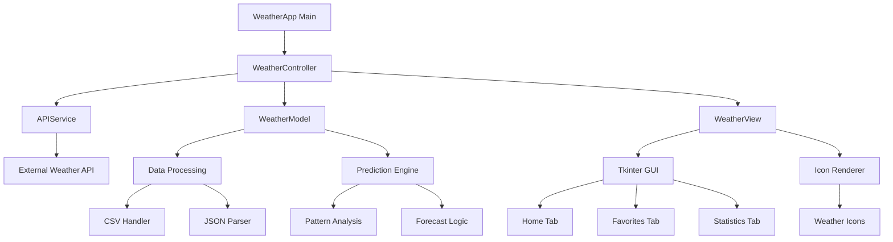

# 🌦️ Weather Dashboard - Shanna Noe

A comprehensive weather application built with Python and Tkinter, featuring real-time weather data, interactive visualizations, and an engaging climate quiz game called "Climate Clues & City Views."

## 🚀 Project Overview

This weather dashboard provides users with current weather conditions, forecasts, historical data analysis, and intelligent weather predictions. The application features a clean, icon-driven interface with multiple tabs for different functionalities, plus an interactive quiz game that challenges users to identify cities based on climate data.

**Developer:** Shanna Noe ([@SNoeCode](https://github.com/SNoeCode))  
**Track:** Data / Visual / Interactive / Smart  
**Status:** Week 18 - Project Complete! 🎉

## 📁 Project Structure

```
weatherdashboard-shanna-noe/
│
├── 📄 main.py                          # Application entry point
├── 📄 weather_app.py                   # Main application class and GUI setup
├── 📄 weather_display.py               # Weather data visualization components
├── 📄 activity_display.py              # Activity recommendations display
├── 📄 create_dashboard_layout.py       # Dashboard layout manager
├── 📄 create_dashboard_layout_ugly.py  # Alternative layout (testing)
├── 📄 weather_data_fetcher.py          # API data retrieval and processing
├── 📄 weather_data_generator.py        # Mock data generation for testing
├── 📄 automated_weather_tracker.py     # Automated data collection service
├── 📄 climate_quiz_game.py             # Interactive climate quiz game
├── 📄 requirements.txt                 # Python dependencies
├── 📄 README.md                        # Project documentation
│
├── 📂 assets/                          # Static assets and resources
│   ├── 🖼️ icons/                       # Weather condition icons
│   │   ├── sunny.png
│   │   ├── cloudy.png
│   │   ├── rainy.png
│   │   ├── snowy.png
│   │   └── default.png
│   └── 📊 data/                        # Sample and test data files
│
├── 📂 data/                            # Application data storage
│   ├── 📄 weather_history.csv          # Historical weather records
│   ├── 📄 prediction_log.json          # Prediction accuracy tracking
│   ├── 📄 mascot_mood_log.txt          # Mascot mood correlation data
│   └── 📄 user_preferences.json        # User settings and preferences
│
├── 📂 tests/                           # Unit tests and test utilities
│   ├── 📄 test_weather_api.py          # API functionality tests
│   ├── 📄 test_data_processing.py      # Data processing tests
│   └── 📄 test_gui_components.py       # GUI component tests
│
└── 📂 docs/                            # Documentation and planning
    ├── 📄 architecture_diagram.md      # System architecture overview
    ├── 📄 api_documentation.md         # API usage documentation
    └── 📄 weekly_reflections.md        # Development progress tracking
```

## 📱 How to Use the App

### Main Dashboard
- **Current Weather:** View real-time conditions with weather icons
- **Forecast:** See upcoming weather predictions
- **Location Search:** Add cities to your favorites list
- **Export Data:** Save weather history to CSV files

### Navigate Between Tabs
- **🏠 Home:** Current weather and today's forecast
- **⭐ Favorites:** Your saved locations and comparisons
- **📊 Statistics:** Historical trends and data analysis
- **🎯 Predictions:** Tomorrow's weather guesses with accuracy tracking

### Play the Climate Quiz
1. Click **"Climate Quiz"** button from any tab
2. **Game Rules:** Guess the city based on weather clues
3. **5 Questions:** Each round pulls data from 2 random datasets
4. **Scoring:** Get feedback and see your geography knowledge improve!

### Key Features to Try
- **Weather Icons:** Notice how icons change with conditions
- **Tomorrow's Guess:** Check prediction accuracy over time
- **Data Export:** Download your weather history
- **Multiple Locations:** Compare weather across different cities

### 🌟 Feature 1: Simple Statistics (⭐ Complete)
- **File Handling:** CSV/JSON/TXT data parsing and processing
- **Data Analysis:** Temperature trends, precipitation patterns, humidity analysis
- **Export Functionality:** Save statistics to various formats
- **Real-time Updates:** Live data synchronization with weather APIs

### 🎨 Feature 2: Weather Icons (⭐⭐ Complete)
- **Dynamic Icons:** Condition-based weather visualization using Pillow
- **Fallback System:** Default icon handling for unknown conditions
- **Responsive Design:** Auto-scaling icons for different UI components
- **Visual Polish:** Enhanced user interface with professional weather imagery

### 🔮 Feature 3: Tomorrow's Guess (⭐⭐⭐ Complete)
- **Pattern Analysis:** Historical data trend recognition
- **Prediction Logic:** Temperature and condition forecasting algorithms
- **Accuracy Tracking:** Prediction vs. actual weather logging
- **User Feedback:** Interactive prediction confidence display

### ✨ Enhancement: Mascot Module (🎭 Complete)
- **Weather Personality:** Mascot responses based on weather conditions
- **Mood Correlation:** Emotional state tracking with weather patterns
- **User Engagement:** Interactive mascot conversations and tips
- **Personalization:** Custom mascot preferences and behaviors

### 🎮 Group Project: "2 Lines 2 Sets" Climate Quiz (🏆 Complete)
- **"Climate Clues & City Views":** Interactive guessing game using 5 datasets
- **Smart Data Selection:** Randomly pulls 2 datasets, 1 line each for comparison
- **City Identification:** Players guess locations based on temperature, humidity, and wind data
- **Dynamic Questions:** Contextual questions based on weather patterns
- **Score Tracking:** 5-question rounds with performance feedback
- **Multi-dataset Integration:** Combines j_weather, s_weather, m_weather, v_weather, and t_weather datasets

## 🏗️ System Architecture



## 📊 Data Management

| File/Table Name       | Format | Purpose                           | Example Entry                                    |
|-----------------------|--------|-----------------------------------|--------------------------------------------------|
| weather_history.csv   | CSV    | Historical weather records        | 2025-07-10,Knoxville,78.5,Clear,45%             |
| prediction_log.json   | JSON   | Prediction accuracy tracking      | {"date": "2025-07-11", "guess": 82, "actual": 79} |
| mascot_mood_log.txt   | TXT    | Mascot mood correlations         | 2025-07-10,Sunny,Happy,Energetic                |
| user_preferences.json | JSON   | User settings and customization  | {"theme": "light", "units": "fahrenheit"}       |

## 🛠️ Technical Stack

- **Language:** Python 3.8+
- **GUI Framework:** Tkinter
- **Image Processing:** Pillow (PIL)
- **Data Processing:** Pandas, JSON, CSV
- **Weather API:** OpenWeatherMap API
- **Testing:** unittest, pytest
- **Version Control:** Git/GitHub

## 🚀 Quick Start

### Prerequisites
- Python 3.8 or higher
- Internet connection for live weather data
- OpenWeatherMap API key (optional - app includes mock data)

### Installation & Setup
1. **Clone and navigate:**
   ```bash
   git clone https://github.com/SNoeCode/weatherdashboard-shanna-noe.git
   cd weatherdashboard-shanna-noe
   ```

2. **Install dependencies:**
   ```bash
   pip install -r requirements.txt
   ```

3. **Run the application:**
   ```bash
   python main.py
   ```
   
4. **Optional - Add your API key:**
   - Get free API key from [OpenWeatherMap](https://openweathermap.org/api)
   - Create `.env` file: `API_KEY=your_key_here`
   - Restart app for live data

### Test the App Immediately
The app works out-of-the-box with sample data, so you can explore all features without any setup!

## 📈 Development Timeline

| Week | Focus Area           | Status     | Key Deliverables                    |
|------|---------------------|------------|-------------------------------------|
| 11   | Project Setup       | ✅ Complete | Architecture design, file structure |
| 12   | Data Foundation     | ✅ Complete | API integration, data models        |
| 13   | Visual Features     | ✅ Complete | Weather icons, UI polish            |
| 14   | Statistics Module   | ✅ Complete | Feature 1 implementation            |
| 15   | Prediction Logic    | ✅ Complete | Feature 3 - Tomorrow's Guess       |
| 16   | Final Features      | ✅ Complete | Mascot feature, documentation       |
| 17   | Demo Preparation    | ✅ Complete | Testing, presentation prep          |
| 18   | Group Project       | ✅ Complete | "2 Lines 2 Sets" climate quiz game |

## 🎯 Project Complete! 🎉

All individual features and the collaborative group project have been successfully implemented and delivered. The weather dashboard now includes comprehensive weather tracking, prediction capabilities, and an engaging educational game component.

## 🧪 Testing Strategy

- **Unit Tests:** Individual component functionality
- **Integration Tests:** API and data flow testing
- **GUI Tests:** User interface interaction testing
- **Performance Tests:** Large dataset handling
- **User Acceptance Tests:** Feature usability validation

## 🔧 Configuration

The application uses several configuration files:

- `config.json` - API keys and application settings
- `user_preferences.json` - User customization options
- `logging.conf` - Logging configuration
- `.env` - Environment variables (not tracked)

## 📝 Weekly Reflections

### Week 18 - Final Project Reflection
- ✅ Successfully completed all individual capstone features
- ✅ Delivered collaborative "2 Lines 2 Sets" group project
- ✅ Created engaging "Climate Clues & City Views" quiz game
- ✅ Integrated 5 different weather datasets into cohesive gameplay
- 🎓 Demonstrated mastery of data handling, GUI development, and team collaboration

### Key Learnings Throughout the Project
- Weather icons dramatically improve user experience
- Proper error handling is crucial for external API dependencies
- Modular code structure makes feature addition much easier
- Visual feedback enhances application usability significantly
- Collaborative coding requires clear communication and consistent data structures
- Game development adds an engaging educational dimension to data applications

## 🎮 Demo Features

When presenting, the application showcases:
1. **Real-time Weather Display** with dynamic icons
2. **Historical Data Visualization** with trend charts
3. **Interactive Favorites System** for multiple locations
4. **Prediction Accuracy Tracking** with visual feedback
5. **Responsive Design** across different screen sizes
6. **"Climate Clues & City Views" Quiz Game** - Interactive climate guessing game

### 🏆 Group Project Highlight: "2 Lines 2 Sets"
The collaborative climate quiz game represents the culmination of our team's data integration skills:
- **Multi-dataset Integration:** Seamlessly combines 5 different weather datasets
- **Smart Random Sampling:** Intelligently selects 2 datasets and pulls 1 record from each
- **Educational Gameplay:** Teaches geography and climate patterns through interactive challenges
- **Dynamic Question Generation:** Creates contextual questions based on weather data patterns
- **Performance Tracking:** Provides immediate feedback and scoring system

## 🤝 Contributing

This is an educational project, but feedback and suggestions are welcome! Feel free to:
- Report bugs or issues
- Suggest new features
- Share improvement ideas
- Provide code review feedback

## 📄 License

This project is created for educational purposes as part of a programming capstone course.

---

**Last Updated:** August 2025  
**Version:** 3.0.0 - Final Release  
**Status:** Project Complete! 🎓🎉